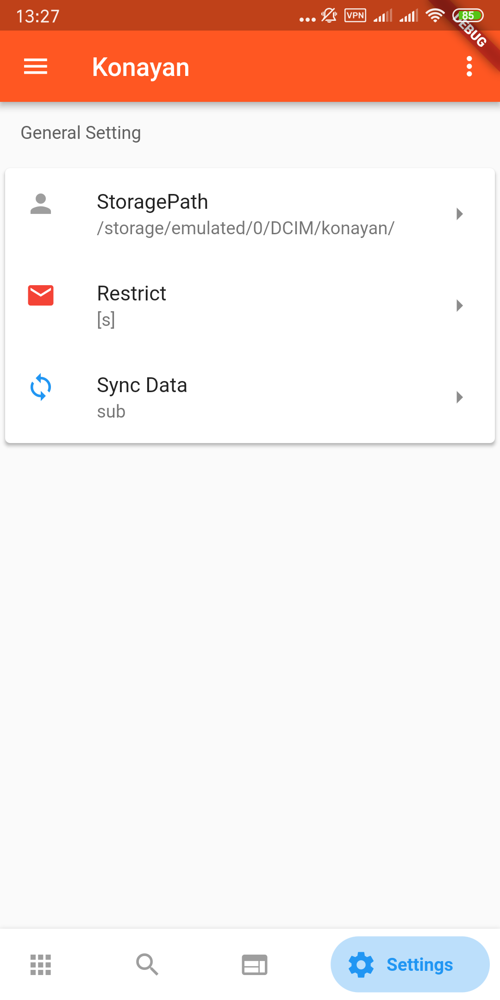

# Konayan
A client for konanchan.net and yande.re
一个在konanchan.net 和 yande.re 间任意切换的android客户端
# Download
[Release](https://github.com/Notsfsssf/Konayan/releases "Release")
or [CoolApk](https://www.coolapk.com/apk/222995),
[Google Play](https://play.google.com/store/apps/details?id=me.perol.play.konayan)
# Preview
||||
|:-------------------:|:------------------------:|:------------------------:|:------------------------:|
# FeedBack
email:PxezFeedBack@outlook.com
# Third-party dependency
    dio: ^2.1.0
    shared_preferences: ^0.5.1+1
    path_provider: ^0.5.0+1
    json_serializable: ^2.0.3
    permission_handler: '^2.2.0'
    flutter_staggered_grid_view: "^0.2.7"
    transparent_image: ^1.0.0
    fluttertoast: ^3.0.1
    file_picker: ^1.3.2
    provider: ^1.6.1
    photo_view: ^0.2.2
    cached_network_image: ^0.7.0
    flutter_cache_manager: ^0.3.2
    objectdb: ^1.0.5
    url_launcher: ^5.0.2